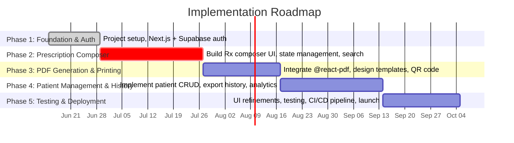

# Executive Summary  
We rewrite each planning step as a developer-facing prompt, grounded in current AI/coding-agent tools and best practices. Our target project is **RxBD – a multi-tenant SaaS digital prescription platform for doctors in Bangladesh**. The agent will be instructed to define goals/features, survey related technology, design architecture, plan implementation, and establish testing/deployment strategies. We ensure thoroughness by citing authoritative sources (e.g. standards for e-prescribing, AI-coding agent surveys, and technology comparisons). Deliverables include rephrased prompt paragraphs, a combined master prompt, a comparative tech-stack table, a milestone timeline (Gantt), and a Mermaid flowchart of component interactions.

## Prompt 1: Define Project Goals and Core Features  
“**Objective:** Clarify the high-level goals and essential functionality for the RxBD digital prescription system.**” In the prompt to the coding agent, describe the target users (doctors in Bangladesh) and the desired outcomes (e.g. modernizing prescription workflows, improving patient safety, cost-effective SaaS delivery). Instruct the agent to list concrete success criteria and core features. For example, the system must support **patient identification**, **medication management**, and **prescription generation** (including PDF printing/QR verification) as key functions. Additional features include multi-doctor accounts, secure digital signatures, medicine search, reusable prescription templates, and data export (CSV/JSON) for records. Also specify constraints (e.g. use of free-tier cloud infra) and expected inputs/outputs (doctor profile, patient data, prescription PDFs, logs). The rewritten prompt should ask the AI to output a clear specification of project objectives and a bulletized list of core features.  
*Example Criteria:* “List the project’s objectives (e.g. seamless e-prescription generation, integration with existing workflows) and core features (patient DB, prescription composer, PDF export, search, multi-tenant support, etc.). Include acceptance criteria (performance targets, security/compliance) and tech assumptions (free-tier infrastructure, mobile-ready UI).”  

## Prompt 2: Survey Existing Coding Agents and OSS Projects  
“**Objective:** Research relevant AI coding assistants and open-source software.” In the prompt for the coding agent, ask it to compare current **AI coding agents** and **open-source projects** that inform our design. For coding agents, mention both closed (e.g. GitHub Copilot, Amazon’s Q/AWS CodeWhisperer, Google Bard/Jules) and open-source (e.g. Cline, OpenHands, Aider, Continue.dev). The agent should identify each tool’s key capabilities and limitations, such as whether it automates multi-step planning or only provides code completion. For example: “Summarize tools like Copilot (chat/code assist), Cline (local-first agent with plan/verify loop), and Aider (terminal-based diff editor), noting openness, control, and tooling features.” 

Likewise, survey open-source digital prescription or healthcare platforms for relevant ideas. For instance, **PrescribePro-Rx** (Bangladesh) is a web-based prescription app, and **MedConnect** (Africa) offers QR-coded e-prescriptions and patient records. Also note global initiatives like Prescrypto’s **RexChain** (Mexico), which uses blockchain for secure, verifiable e-prescriptions. The prompt should ask the agent to compile a brief overview of each project/agent (purpose, status, license) and highlight design takeaways (e.g. data model patterns, user flows, open-source practices). The output should be a comparative list or table of agents and projects with pros/cons of each.  

## Prompt 3: Design System Architecture and Component Interactions  
“**Objective:** Define a high-level system architecture with components and data flows.” In the prompt, instruct the agent to design the overall architecture of RxBD. Specify components such as a **Next.js frontend**, a **backend/API layer**, **database**, **authentication**, **search engine**, **PDF generation**, and **monitoring** services. For example: “Outline the architecture for a Next.js/Supabase-based SaaS app. Identify how users (doctors) interact with the web UI, how frontend pages and API routes call backend services, and how data is stored in PostgreSQL with Supabase Auth. Emphasize multi-tenancy: use Row-Level Security in Postgres to isolate each doctor’s data. Illustrate inter-component communication (e.g. API calls, auth token flows, data queries).”  

Ask the agent to produce a descriptive architecture diagram (in Mermaid or similar) showing component interactions. For example, the flowchart should show: Doctor → Next.js App (UI) → Next.js API Routes → Supabase (Auth & Database) → Storage for assets. Include services like **Supabase Auth (GoTrue)**, **PostgREST API**, **Storage (S3)**, and external integrations (payment gateway, monitoring tools). Cite best practices: for instance, Supabase uses a Kong API gateway fronting GoTrue (auth), PostgREST (DB API), Realtime, etc., all on one Postgres core. The prompt output should clearly name each component, describe its role, and explain the data flow between them.  

## Prompt 4: Create Implementation Roadmap with Milestones and Tech Stack  
“**Objective:** Develop a phased implementation plan and compare tech stacks.” In the agent prompt, instruct creation of a development roadmap with **phases** and **milestones**. For example: “Phase 1 – Foundation & Auth (Next.js project setup, Supabase Auth for user login). Phase 2 – Prescription Engine (build Rx composer UI, autosave to localStorage). Phase 3 – PDF & Printing (integrate `@react-pdf/renderer`, design templates). Phase 4 – Patient Management (CRUD patient profiles, view history). Phase 5 – Testing & Deployment (CI/CD setup, finalize UI polish, add payment flow).” For each phase include estimated duration (e.g. 3–5 weeks) and deliverables (code, documentation).  

Additionally, require the agent to evaluate **three candidate technology stacks**, detailing pros/cons, effort, and suitability. For example:

- **Stack A (JavaScript/Next.js):** Next.js + React + Supabase (Postgres) + Tailwind + Vercel. Pros: unified JS stack, fast dev with many libraries (npm ecosystem), server-side rendering and static generation built-in. Cons: complexity grows (multiple data-fetch patterns), reliance on Vercel platform for SSR. 
- **Stack B (Python/Django):** Django backend + React or Vue frontend + PostgreSQL. Pros: “batteries-included” framework (ORM, auth, admin) for rapid dev, clear MVC architecture. Cons: additional overhead setting up separate frontend, potentially slower raw performance than Node.js. 
- **Stack C (PHP/Laravel):** Laravel + Vue or React + MySQL. Pros: PHP is easy to host, Laravel offers quick scaffolding (ORM, auth), familiar to many developers. Cons: less performant than Node or Java, concurrency limited in traditional model. 

The prompt should instruct the agent to populate a comparison table (see **Tech Stack Comparison** below) and choose one stack or justify trade-offs. Also generate a Gantt-style timeline (Mermaid) with these phases and durations.  

## Prompt 5: Plan Testing, Metrics, and Deployment Strategy  
“**Objective:** Specify testing approach, success metrics, and deployment plan.” Ask the agent to outline a comprehensive testing and deployment strategy. For testing, include unit tests (e.g. Jest for React, backend tests), integration tests (database queries, API endpoints), and end-to-end UI tests (e.g. Cypress) covering all critical flows (login, prescription creation). Define quality criteria (e.g. 80%+ code coverage, all critical bugs resolved before release). 

For evaluation metrics, instruct defining KPIs for functionality and performance. Examples: **system performance** (page load < 2s, API latency < 200ms under load), **reliability** (99.9% uptime, no data loss), and **business goals** (e.g. onboarding 100 doctors, X prescriptions/month). Also include security/privacy goals: patient data encrypted in transit and at rest, strict access control and RLS for data isolation, SSL for external APIs (e.g. payment processing via SSLCommerz). 

For deployment, detail the CI/CD pipeline: e.g. use GitHub Actions to lint, test, and deploy to Vercel for production and a staging preview on pull requests. Plan environment setup (separate dev/staging/prod Supabase projects, environment variables managed securely). Include rollback procedures and monitoring (integrate Sentry/LogRocket for error tracking). Mention compliance checks (e.g. local health data laws) and performance benchmarks. The prompt output should be a structured plan covering tests (unit/integration), metrics (performance targets, usage), and deployment (steps, tech, schedule).  

## Consolidated Master Prompt  
The final **master prompt** combines all tasks into one comprehensive instruction for the coding agent. It might read as follows (in more concise form):  

```
You are tasked with designing and prototyping “RxBD,” a multi-tenant SaaS digital prescription platform for doctors in Bangladesh. 

First, list the project’s high-level goals (e.g. modernize prescription workflows, ensure data security, cost-efficiency) and core features (patient records, prescription composer with medicine search, PDF export with signature, multi-doctor support, etc.). Define clear acceptance criteria for functionality, performance, and security. 

Next, survey existing AI coding assistants and relevant OSS projects. Compare tools like GitHub Copilot, Amazon CodeWhisperer (Q), Google Bard (Jules), and open-source agents like Cline or Aider, noting their key capabilities (planning, diff previews, integrations). Also summarize related open-source health apps (e.g. PrescribePro-Rx for Bangladesh, MedConnect, Prescrypto’s RexChain) that could inform our design, listing pros/cons of each approach. 

Then design the system architecture: identify components (Next.js frontend, API routes, Supabase Auth/Database, PDF service, monitoring, payment gateway, etc.) and show how they interact. Use Supabase’s RLS to isolate tenants. Provide a Mermaid flowchart illustrating user flow (doctor logs in → builds prescription → data saved to DB → PDF generated). 

After that, create a phased implementation plan with milestones and timeline. Outline 3–5 development phases (foundation, prescription engine, PDF integration, patient management, final polish) with estimated effort. Evaluate three tech stacks (e.g. Next.js/TypeScript/Supabase, Python/Django+React, PHP/Laravel+Vue), listing pros/cons, development effort, and suitability for this project. 

Finally, plan testing and deployment: define unit/integration/end-to-end tests, performance and reliability metrics, and a CI/CD strategy (e.g. GitHub Actions deploying to Vercel). Address data privacy, encryption, and compliance. Summarize this plan as a cohesive developer roadmap.  
```  

## Candidate Tech Stacks Comparison  

| **Stack**                                  | **Pros**                                                                                          | **Cons**                                                            | **Effort**   | **Suitability**                                        |
|--------------------------------------------|---------------------------------------------------------------------------------------------------|---------------------------------------------------------------------|--------------|--------------------------------------------------------|
| **Next.js (React) + Supabase** (JavaScript/TypeScript) | *Unified full-stack JS (frontend + API)*; built-in SSR/SSG for performance; massive NPM ecosystem; built-in auth and serverless functions (Vercel). Excellent for rapid prototyping and rich interactivity.  | Can become complex at scale (multiple rendering modes); reliance on specific hosting (Vercel); slightly steeper learning curve for advanced Next.js features.  | Low–Medium (many libraries & templates); scalable via serverless. | Very high – aligns with modern JAMstack SaaS; good for MVP and future growth. |
| **Python (Django) + React**                | *High dev speed with “batteries-included” framework* – ORM, auth, admin UI out of box; clear MVC structure; Python’s readability.  | Needs separate frontend setup (React) or Django templates; Python (interpreted) may have slower runtime; requires own hosting (e.g. Heroku, AWS).  | Medium (Django setup + API, React integration) | High – great for data-intensive apps; mature ecosystem (healthcare libraries), though more backend-centric. |
| **PHP (Laravel) + Vue/React**              | *Fast prototyping* with Laravel (Eloquent ORM, auth scaffolding); huge PHP hosting support; straightforward for CRUD apps.  | Lower raw performance than Node/Java; traditionally one-request-per-process model (less concurrency); less built-in for real-time features.  | Low (many tutorials, shared hosting); easy to find PHP devs. | Medium – good for simpler apps or where PHP dev familiarity is high; may need extra work for real-time features. |

(**Estimated Effort:** Each phase ~3–4 weeks for a small team; total ~4–5 months to MVP.) 

## Implementation Timeline (Gantt)  



## Component Interaction Diagram  

```mermaid
flowchart LR
    subgraph User
      A[Doctor User]
    end
    subgraph Frontend
      B[Next.js UI] --> C{Prescription Form}
      D[React Components] --> C
    end
    subgraph Backend
      E[Next.js API Routes]
      F[Supabase Auth (GoTrue)]
      G[Supabase PostgreSQL]
      H[Supabase Storage]
    end
    subgraph External
      I[Payment Gateway (SSLCommerz)]
      J[Monitoring (Sentry)]
    end
    A --> B
    B --> C
    C --> E
    E --> F
    E --> G
    E --> H
    F --> G
    A --(\SMS/Email)--> I
    E --> J
```  

**Figure:** The flowchart illustrates key components. The doctor interacts via the Next.js frontend, which calls API routes. The backend uses Supabase Auth and Database (Postgres) for data/storage. Each Supabase service (Auth, Realtime, Storage) communicates with a central Postgres. We use RLS policies in Postgres to isolate each doctor’s data. The monitoring tool (Sentry) captures runtime errors, and payment/SMS integration handle premium subscriptions and notifications.  

Each section and artifact above is designed to guide an AI coding assistant through project planning, ensuring clarity of goals, architecture, and milestones, backed by research and industry standards.